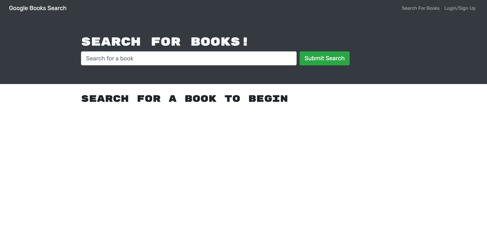

# Book Search - MERN 

## Table of Contents:

- [Description](./README.md#description)
- [License](./README.md#license)
- [Contributing](./README.md#contributing)
- [Screenshot](./README.md#screenshot)
- [Links to Application](./README.md#links-to-application)
- [Questions](./README.md#questions)

## Description

React application that uses node.js and express.js with a mongo database to create a search engine to look up different books using a search bar. User can sign up or login and their information is saved into the database using bcrypt.

## License

This software is licensed to MIT, for more information you may visit this link:
[MIT License Wikipedia](https://en.wikipedia.org/wiki/MIT_License)

## Contributing

If you wish to contribute to our content, please contact one of us at:

- smarr2198@gmail.com

## Screenshot

## Links to Application

- Here is the link to the repo: [smarr2198/repo](https://github.com/smarr2198/BookSearch-MERN)
- Here is the link to the heroku: [smarr2198/heroku](https://book-search-smarr2198.herokuapp.com/)

## Questions

If you have any questions, you may contact:

#### Stephen Marr

- Email: smarr2198@gmail.com
- Github Profile: [https://www.github.com/smarr2198](https://www.github.com/smarr2198)
